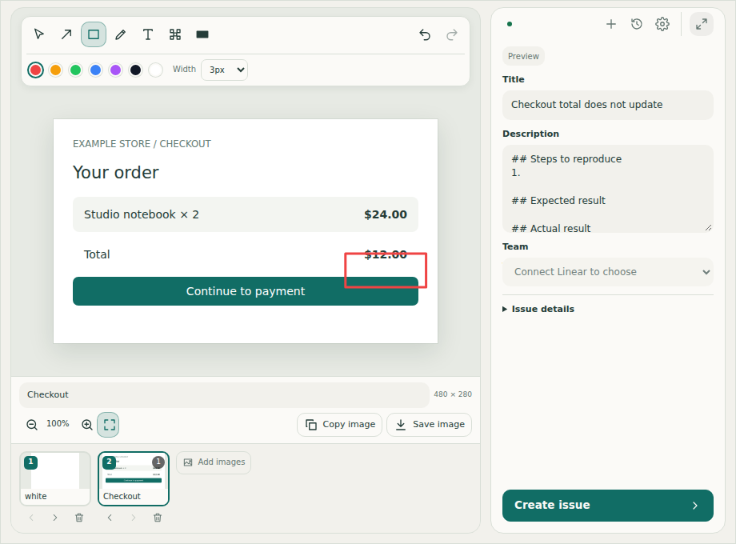
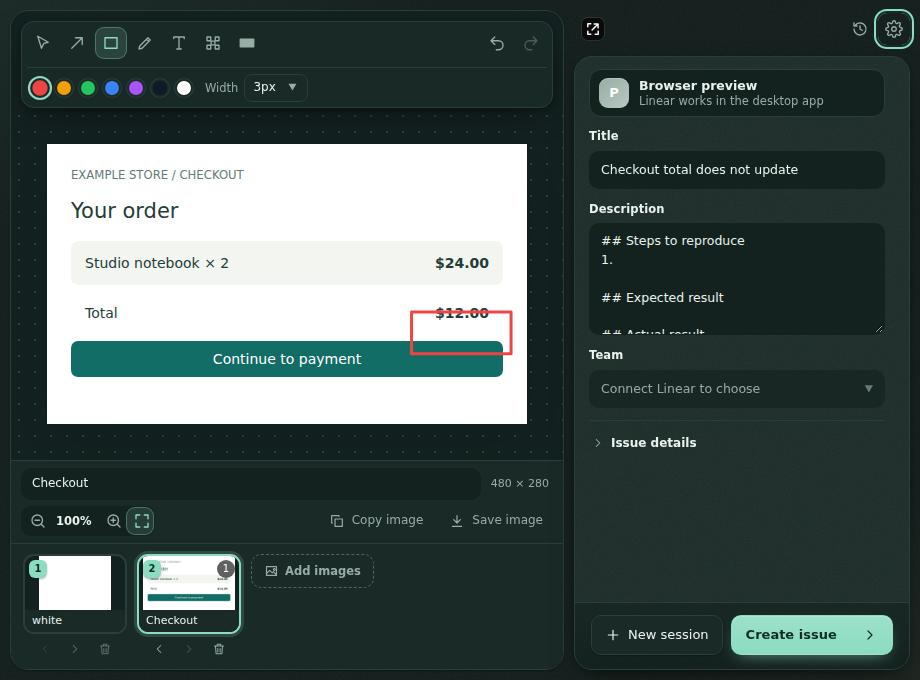
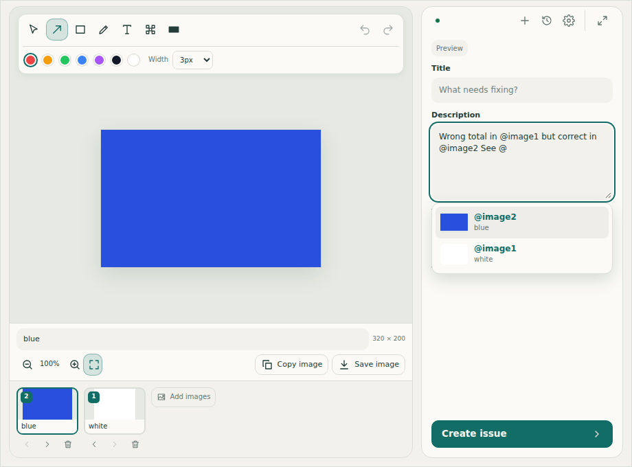
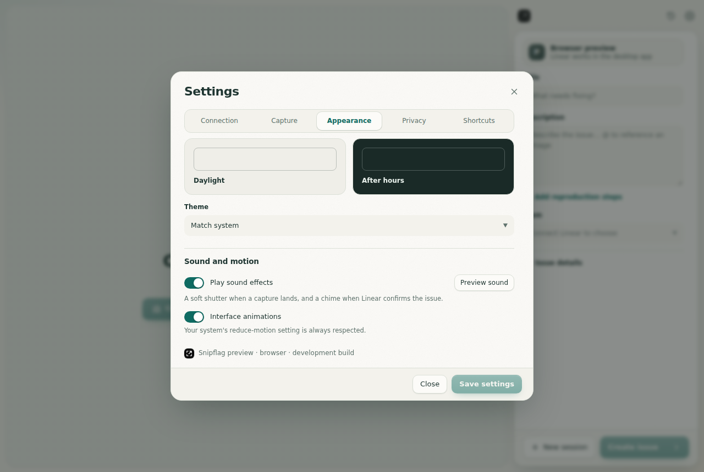

  

<h1 align="center">Snipflag</h1>

  <strong>Snip it. Mark it. Flag it.</strong> 
  Turn one or more screenshots into one clear Linear issue.

  <a href="#features">Features</a> ·
  <a href="#getting-started">Getting started</a> ·
  <a href="#connecting-linear">Connecting Linear</a> ·
  <a href="#privacy">Privacy</a> ·
  <a href="CONTRIBUTING.md">Contributing</a>

---

Snipflag is a focused desktop app for reporting visual problems. Capture a region of your screen, mark what matters, capture another, add a title, and send everything to Linear as a single issue with the screenshots in order. It runs on Windows (primary), macOS, and Linux, and is built with Tauri 2, Rust, React, and TypeScript.

> **v1.0.0:** [Download the release (unsigned installers)](https://github.com/Razee4315/snipflag/releases/tag/v1.0.0). Native runtime acceptance and signing are still pending; see [verification status](docs/STATUS.md).

## Screenshots

CI-rendered UI previews using synthetic sample images. Native window controls and the connected Linear state differ from browser preview.

Dark theme, image mentions, and settings

## Features

**Capture**
- Lives in the system tray with a global shortcut (default `Ctrl+Shift+2`, `Cmd+Shift+2` on macOS).
- Freezes every monitor, then you drag a region. Enter captures the whole screen, Escape cancels.
- Also add images from files (PNG, JPEG, WebP), paste from the clipboard, or drag and drop.

**Annotate**
- Arrow, rectangle, pen, text, pixelate, and solid redaction.
- Hold Shift for 15° arrow/pen snapping or square rectangles.
- Select, move, and resize marks; change color, width, and text size; zoom, fit, and 100%.
- Each screenshot keeps its own annotations and undo history, so you can move between them freely.
- Exports keep the original pixel dimensions, and redaction is burned into the pixels.

**Report**
- Up to 10 screenshots per session, reorderable and captioned, sent as one issue.
- Title, description, team, project, assignee, labels, and priority, without leaving the app.
- Type `@` in Description to choose a screenshot. References survive reordering and become clickable image links in Linear.
- Safe retries: each session has a stable issue ID, so a retry after a network failure checks Linear first and never creates a duplicate.

**Keep your work**
- Drafts save automatically and come back after a restart.
- History to reopen or delete past sessions, with a retention setting.

### Keyboard shortcuts

| Action | Shortcut |
|---|---|
| Capture (global) | `Ctrl/Cmd + Shift + 2` (configurable) |
| Select, Arrow, Rectangle, Pen, Text | `V`, `A`, `R`, `P`, `T` |
| Pixelate, Redact | `B`, `X` |
| Undo, Redo | `Ctrl/Cmd + Z`, `Ctrl/Cmd + Shift + Z` |
| Delete selected mark | `Delete` |
| Create issue | `Ctrl/Cmd + Enter` |
| Zoom | `Ctrl/Cmd + mouse wheel` |

## Getting started

Download [v1.0.0 installers](https://github.com/Razee4315/snipflag/releases/tag/v1.0.0) from GitHub Releases. All installers are built on GitHub Actions.

Additional development installers are produced by the [Development installers](https://github.com/Razee4315/snipflag/actions/workflows/build.yml) workflow:

| Platform | Artifact | Formats |
|---|---|---|
| Windows x64 | `snipflag-development-unsigned-x86_64-pc-windows-msvc` | NSIS `.exe`, `.msi` |
| macOS Apple Silicon | `snipflag-development-unsigned-aarch64-apple-darwin` | `.dmg` |
| macOS Intel | `snipflag-development-unsigned-x86_64-apple-darwin` | `.dmg` |
| Linux x64 | `snipflag-development-unsigned-x86_64-unknown-linux-gnu` | `.deb`, `.AppImage` |

These builds are not code-signed, so Windows SmartScreen and macOS Gatekeeper will warn before opening them. Actions artifacts expire after 7 days; the release downloads remain available.

On macOS, grant Screen Recording permission when asked. On Linux Wayland, some compositors block direct capture; adding or pasting images still works.

## Connecting Linear

Snipflag signs in to Linear with OAuth and PKCE. No client secret is used, and the resulting token is kept in your operating system's credential store.

1. In Linear, open **Settings, API, OAuth applications** and create an application.
2. Add the callback URL `http://127.0.0.1:47839/callback`.
3. Copy the application's **client ID** into Snipflag **Settings**, then choose **Connect Linear**.

Builds can also embed a client ID through the `SNIPFLAG_LINEAR_CLIENT_ID` repository variable. More detail is in [docs/LINEAR.md](docs/LINEAR.md).

## Privacy

- Screenshots stay on your computer until you choose **Create issue**.
- Linear is contacted only to sign in, load your teams and fields, and create the issue you submit.
- No analytics, no screenshot cloud, and no account needed to capture or annotate.
- Use **Redact** for secrets. It paints opaque pixels over the area in every export. Pixelate is cosmetic and should not be relied on to hide information.
- Drafts are stored unencrypted in the app data folder. You can delete them from History or Settings.

Details are in [docs/SECURITY.md](docs/SECURITY.md). To report a vulnerability, see [SECURITY.md](SECURITY.md).

## Development

All builds, tests, and packaging run on GitHub Actions. The [contributing guide](CONTRIBUTING.md) covers the project layout, engineering rules, running the app locally, and how to open a pull request.

## Documentation

| Topic | Document |
|---|---|
| Product scope and acceptance criteria | [docs/PRODUCT.md](docs/PRODUCT.md) |
| Screens and interaction flows | [docs/UX.md](docs/UX.md) |
| Visual language and brand | [docs/DESIGN.md](docs/DESIGN.md) |
| Architecture and data lifecycle | [docs/ARCHITECTURE.md](docs/ARCHITECTURE.md) |
| Linear integration | [docs/LINEAR.md](docs/LINEAR.md) |
| Privacy and command boundaries | [docs/SECURITY.md](docs/SECURITY.md) |
| Builds and releases | [docs/CI.md](docs/CI.md) |
| Test matrix | [docs/TESTING.md](docs/TESTING.md) |
| Current status and next steps | [docs/STATUS.md](docs/STATUS.md) |
| Name research | [docs/NAME.md](docs/NAME.md) |
| Changes | [CHANGELOG.md](CHANGELOG.md) |
| Help | [SUPPORT.md](SUPPORT.md) |

## License

Snipflag is released under the [MIT License](LICENSE).

Linear is a trademark of Linear Orbit, Inc. Snipflag is an independent project and is not affiliated with or endorsed by Linear.
